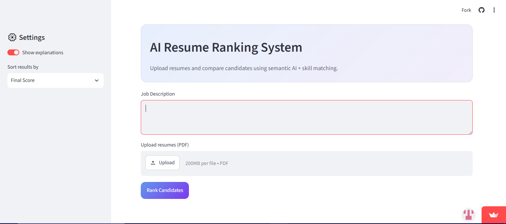
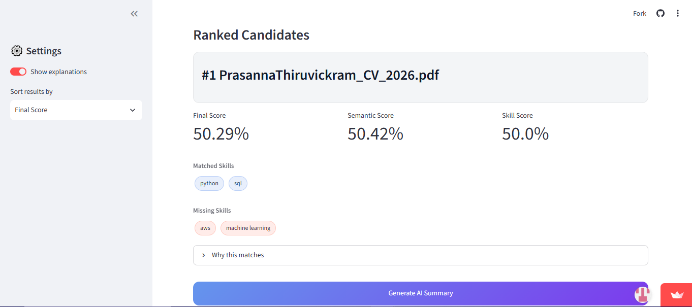
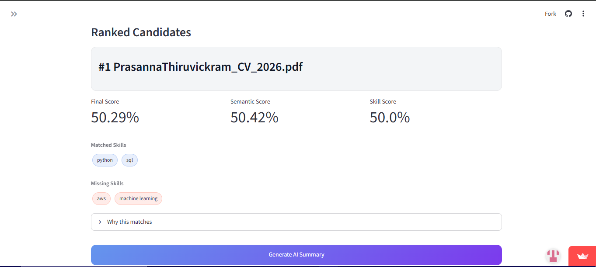
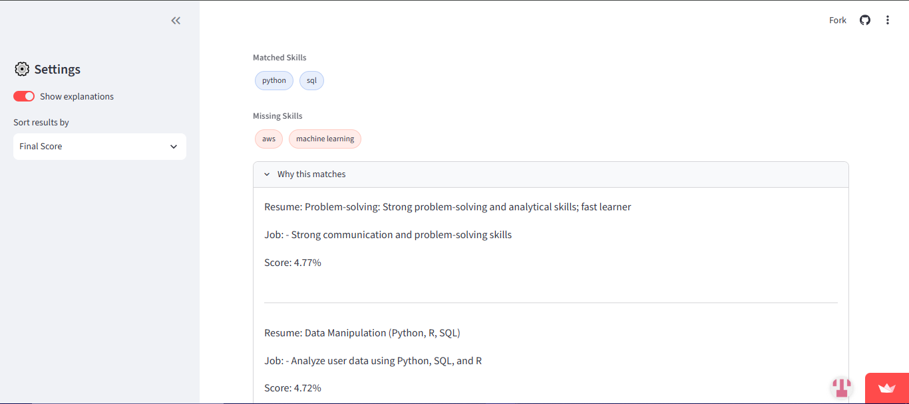
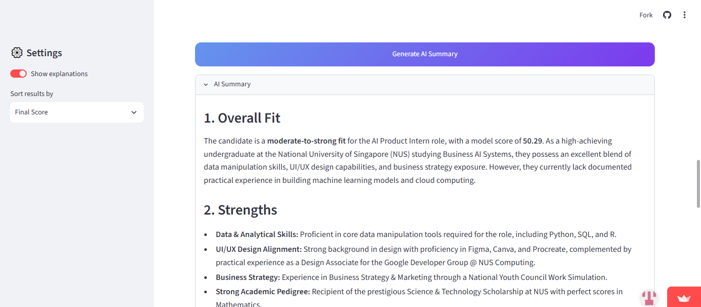
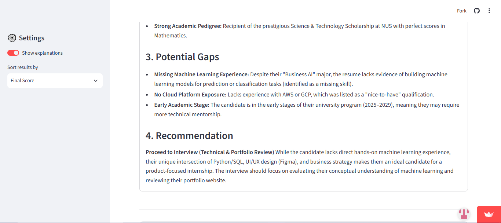

# 📄 AI Resume Ranking System

An AI-powered resume screening application that helps recruiters evaluate and rank candidates based on how well they match a given job description.

Rather than relying solely on keyword matching, the application combines **transformer-based Natural Language Processing (NLP)**, **semantic relevance scoring**, **skill matching**, and **Gemini API** to produce a more meaningful candidate evaluation.

---

# 🚀 Live Demo

**Try the deployed application here:**

**https://resume-ai-ranker.streamlit.app/**

> **Note:** The screenshots below provide a preview of the application. To explore the full experience—including uploading resumes, ranking candidates, viewing sentence-level explanations, and generating AI hiring summaries—please visit the live demo.

---

# 📸 Application Preview

##  Home Page



---

##  Upload Job Description & Resumes



---

##  Ranked Candidates



---

##  Additional Candidate Results



---

##  AI Hiring Summary



<br>



---

# ✨ Features

## 📄 Resume Upload & Processing

* Upload multiple resumes in **PDF** format
* Extract text automatically using **PyMuPDF**
* Prepare resumes for semantic analysis without manual preprocessing

---

## 🧠 Intelligent Candidate Ranking

Instead of comparing resumes using simple keyword overlap, the application uses a **CrossEncoder transformer model (`ms-marco-MiniLM-L6-v2`)**.

Unlike traditional embedding-based similarity methods, the CrossEncoder jointly evaluates the **resume** and **job description** before producing a semantic relevance score. This allows it to better understand context, wording, and relationships between both documents.

Each candidate receives:

*  Semantic Relevance Score
*  Skill Matching Score
*  Final Overall Ranking Score

---

## 🔍 Explainable AI

Rather than returning only a score, the system also explains **why** a candidate ranked highly.

Each candidate includes:

* Matched skills
* Missing skills
* Sentence-level semantic matches between the resume and job description

---

## 🤖 AI Hiring Summary

Google Gemini generates recruiter-style hiring reports based on the resume and ranking results.

Each report includes:

* ✅ Overall candidate fit
* 💪 Key strengths
* ⚠️ Potential skill gaps
* 📌 Hiring recommendation

---

# 🛠️ Tech Stack

| Technology                               | Purpose                                                        |
| ---------------------------------------- | -------------------------------------------------------------- |
| **Python**                               | Core application logic, resume processing and ranking pipeline |
| **Streamlit**                            | Interactive web application and user interface                 |
| **Sentence Transformers (CrossEncoder)** | Transformer-based semantic relevance scoring                   |
| **Google Gemini API**                    | AI-generated recruiter summaries                               |
| **PyMuPDF**                              | PDF text extraction                                            |
| **NumPy**                                | Numerical computations and score normalization                 |

---

# 📁 Project Structure

```text
resume-ai/
│
├── app.py                 # Streamlit interface
├── utils.py               # Resume processing & ranking logic
├── gemini.py              # Google Gemini integration
├── requirements.txt       # Python dependencies
├── README.md
└── images/
    ├── RAIR1.PNG
    ├── RAIR2.PNG
    ├── RAIR3.PNG
    ├── RAIR4.PNG
    ├── RAIR5.PNG
    ├── RAIR6.PNG
    └── RAIR7.PNG
```

---

# 🔮 Future Improvements

* Support additional resume formats (DOCX, TXT)
* Candidate comparison dashboard
* Recruiter feedback-based ranking refinement
* Batch AI summary generation
* Expanded domain-specific skill database

---

# 👨‍💻 Author

Developed as a portfolio project demonstrating the application of **Natural Language Processing, transformer-based semantic search, document processing, and Generative AI** to automate resume screening and candidate evaluation.


